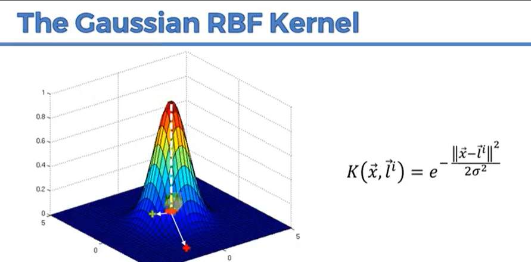

# Kernel SVM

## Introduction

Kernel SVM is a type of SVM which uses kernel trick to transform the input space into a higher dimensional space. It is mostly used for non-linearly separable data. It is a powerful algorithm which can be used for both classification and regression problems.

## High Computing Power Required

Kernel SVM is computationally intensive and requires high computing power. It is not suitable for large datasets.

## Solution

### Gaussian RBF Kernel

The most commonly used kernel is the Gaussian RBF kernel. It is used to transform the input space into an infinite dimensional space. It is defined as:

## Types of Kernel Functions

1. Gaussian RBF Kernel
2. Polynomial Kernel
3. Sigmoid Kernel

