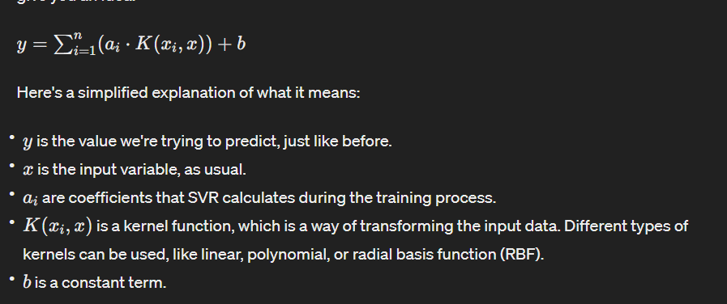

# Support Vector Regression

Support Vector Regression (SVR) is a bit different from linear and polynomial regression. Instead of fitting a line or a curve to your data, SVR finds a "tube" around the data points.

Imagine your data points scattered across a graph. SVR tries to find a tube-like structure that fits around as many points as possible, while still allowing some points to be outside the tube. These points outside the tube are called "support vectors".

The formula for SVR might not be as straightforward as linear or polynomial regression, but I'll give you an idea:

## Formula for Support vector regression

## Intiution

SVR is particularly useful when your data doesn't follow a clear linear or polynomial pattern, and you want a more flexible model that can adapt to different shapes of data distributions.

So, in simple terms, SVR finds a tube-like structure around your data points to make predictions, allowing for flexibility and robustness, especially in cases where linear or polynomial regression might not work well.

